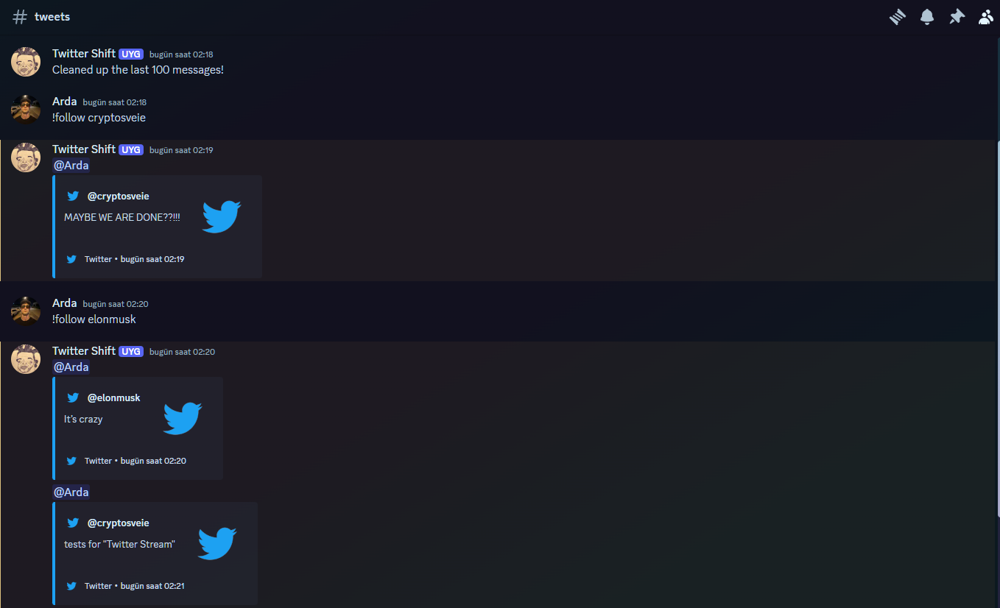
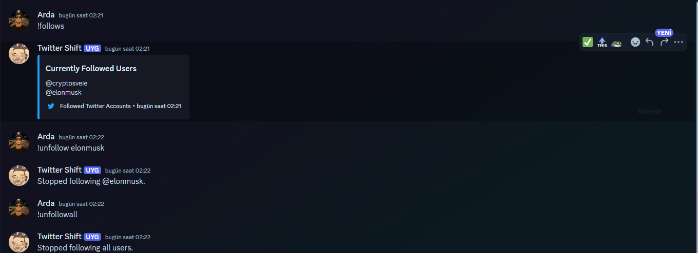

# Twitter Stream

A Discord bot that allows users to follow specific Twitter accounts and receive live updates in a Discord channel. The bot interacts with Twitter using Puppeteer and provides commands for following and unfollowing users, displaying followed users, and cleaning messages.

## Features

- **Follow Twitter Accounts**: Follow a Twitter account and get the latest tweets as messages in a Discord channel.
- **Unfollow Twitter Accounts**: Unfollow a specific Twitter account or all followed accounts.
- **Display Followed Accounts**: View a list of all Twitter accounts being followed.
- **Clean Messages**: Clean up recent messages in the Discord channel.

## Prerequisites

- **Node.js**: Version 14 or above.
- **Discord.js**: Discord API wrapper for Node.js.
- **Puppeteer**: Headless browser automation tool to interact with Twitter.

## Installation

1. **Clone the Repository**

   ```bash
   git clone https://github.com/ardaakay0/twitter_stream.git
   cd twitter_stream
   ```

2. **Install Dependencies**

   ```bash
   npm install discord.js puppeteer
   ```

3. **Set Your Credentials**
   
   Update the following variables in `index.js` (or equivalent file):
   - `TWITTER_USERNAME`: Your Twitter username.
   - `TWITTER_PASSWORD`: Your Twitter password.
   - `TOKEN`: Your Discord bot token.

## Usage

Run the bot using the following command:

```bash
node index.js
```

### Discord Commands

- **`!follow {username}`**: Start following a specific Twitter user. 
  ```
  !follow elonmusk
  ```

- **`!unfollow {username}`**: Stop following a specific Twitter user. 
  ```
  !unfollow elonmusk
  ```

- **`!unfollowall`**: Stop following all Twitter accounts being monitored.
  ```
  !unfollowall
  ```

- **`!follows`**: Display a list of all followed Twitter accounts.
  ```
  !follows
  ```

- **`!clean`**: Clean up the last 100 messages in the channel.
  ```
  !clean
  ```


## Screenshots




## Notes

- The bot uses Puppeteer to interact with Twitter, which means Twitter may detect and block the bot if refreshes are too frequent. To prevent this, the refresh interval is randomized between 45 and 60 seconds, and the User-Agent string is rotated.
- The bot must be logged into Twitter to access tweets.


## Troubleshooting

- **Invalid Token**: Ensure the Discord bot token is correctly set in the `TOKEN` variable.
- **Twitter Login Issues**: Twitter may temporarily block access due to too many refreshes. Consider adjusting the refresh rate or adding more sophisticated bot detection bypasses.


